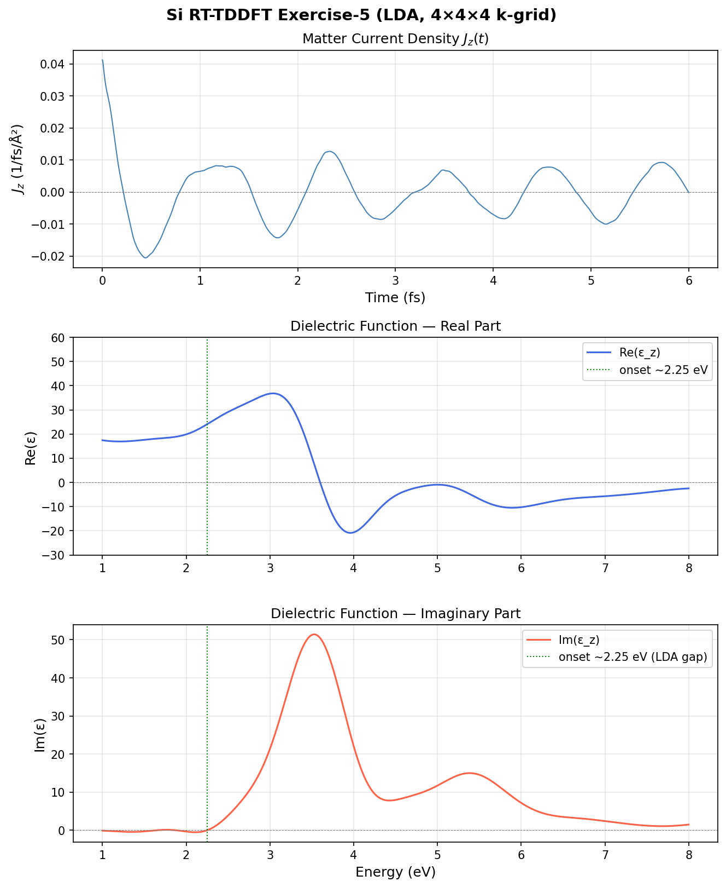
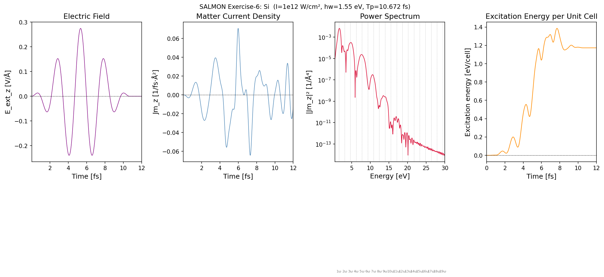

# SALMON TDDFT Exercises: Crystalline Silicon

石川研究室（東京大学）でのSALMON（第一原理計算コード）を用いたTDDFT計算の記録。  
Exercise-5（誘電関数計算）とExercise-6（レーザーパルス照射計算）の入力ファイル・解析スクリプト・結果をまとめる。

---

## 計算環境

- **コード**: [SALMON v2.0.1](https://salmon-tddft.jp/jp/salmon.html)
- **サーバー**: 石川・佐藤研 R285s001（32コア MPI並列）
- **ジョブ管理**: PBS/Torque

---

## Exercise-5: 誘電関数計算（線形応答 TDDFT）

### 何を計算するか

結晶シリコンの**光学的誘電関数 ε(ω)** を計算する。  
これは「光を当てたとき、シリコンがどれだけ分極するか」を周波数ごとに表した量。

### 物理的背景

**誘電関数とは**  
物質中の電場 **E** と電束密度 **D** の関係: **D** = ε(ω)**E**  
ε(ω) = ε₁(ω) + iε₂(ω) と複素数で書かれる。

- **ε₁（実部）**: 分散（光の速度変化・屈折）を記述
- **ε₂（虚部）**: 吸収を記述。**ε₂ > 0 のエネルギー域で光が吸収される**

**バンドギャップとの関係**  
シリコンは半導体。光子エネルギーがバンドギャップ Eg 以上のとき、電子がバレンスバンドからコンダクションバンドに励起され、光が吸収される。  
→ **Im(ε) は Eg 付近から立ち上がる**

- LDA計算での直接バンドギャップ ≈ **2.4 eV**（実験値 3.4 eV、LDAは過小評価する傾向）
- 静電誘電率 ε₁(0) ≈ 12（実験値 11.9）

**TDDFT線形応答の計算手順**  
```
① GS計算 → 基底状態の波動関数 u_nk(r) を取得
② z方向にインパルス摂動を与える（弱い瞬間的電場）
③ 時間発展計算 → 電流密度 J_z(t) を記録
④ J(t) をフーリエ変換 → 伝導率 σ(ω)
⑤ ε(ω) = 1 + 4πiσ(ω)/ω
```

### 計算パラメータ

| パラメータ | 値 | 意味 |
|---|---|---|
| `num_rgrid` | 12×12×12 | 実空間グリッド数 |
| `num_kgrid` | 4×4×4 | k点サンプリング |
| `dt` | 0.002 fs | 時間ステップ |
| `nt` | 3000 | 総ステップ数（6 fs） |
| `ae_shape1` | `impulse` | インパルス摂動 |

> ⚠️ **重要**: GS計算と RT計算で `num_rgrid`・`num_kgrid` を必ず一致させること。  
> 不一致の場合、誘電関数が物理的に意味のない値になる（今回実際に踏んだトラブル）。

### 結果



- **Im(ε) が 2.4 eV付近から正値で立ち上がる** → LDA直接バンドギャップと一致
- **Re(ε) の静的値** ≈ 12 → 実験値（11.9）と良好に一致
- 3.4 eV・4.2 eV付近のピーク（E₁・E₂ 臨界点）が再現されている

---

## Exercise-6: レーザーパルス照射（RT-TDDFT）

### 何を計算するか

有限強度のフェムト秒レーザーパルスを照射したとき、シリコン中の**電子がどう応答するか**を実時間計算する。

### 物理的背景

**実時間 TDDFT とは**  
外場 A(t)（ベクトルポテンシャル）を加えた時間依存 Kohn-Sham 方程式を数値積分:

```
iℏ ∂/∂t ψ_nk(r,t) = H_KS[n(r,t), A(t)] ψ_nk(r,t)
```

外場が強い（非線形応答領域）でも直接計算できるのが強み。

**パルス形状（Acos2）**  
ベクトルポテンシャルが cos²(πt/T) の包絡線を持つ形。Electric field:
```
E(t) = E₀ · cos²(πt/Tw) · cos(ωt)
```

**高次高調波（HHG: High Harmonic Generation）**  
強レーザー場中で電子がポテンシャルを往復し、n·ω (n=奇数) の光を放出する現象。  
Power spectrum の対数プロットで **奇数次の高調波ピーク（1ω, 3ω, 5ω...）** として観測される。

**励起エネルギー**  
パルス照射後に電子系に吸収されたエネルギー。強度・パルス幅・光子エネルギーに依存する。  
バンドギャップより光子エネルギーが小さくても（本計算: 1.55 eV < 2.4 eV）、多光子過程により励起が起きる。

### 計算パラメータ

| パラメータ | 値 | 意味 |
|---|---|---|
| `ae_shape1` | `Acos2` | cos²包絡のパルス |
| `I_wcm2_1` | 1×10¹² W/cm² | ピーク強度（比較的弱い） |
| `omega1` | 1.55 eV | 光子エネルギー（赤外） |
| `tw1` | 10.672 fs | パルス幅 |
| `nt` | 6000 | 総ステップ数（12 fs） |

### 結果



1. **Electric Field**: cos²包絡のパルスが 0〜11 fs に印加。6 fs付近でピーク。
2. **Matter Current Density**: パルスに追随して J_z が振動。パルス後も自由振動が残る。
3. **Power Spectrum**: 1ω（1.55 eV）の基本波が最大。3ω, 5ω... の奇数次高調波が減衰しながら続く。I = 10¹² W/cm² は比較的弱い強度なので高次は急激に弱まる。
4. **Excitation Energy**: パルス照射中に急増し、最大約 1.4 eV/cell。パルス後 ~1.2 eV/cell で安定（電子励起が残存）。

---

## ディレクトリ構成

```
.
├── README.md
├── work_log.md                          # 作業ログ・トラブルシューティング
├── exercise5_dielectric/
│   ├── gs/
│   │   ├── Si_gs.inp                   # GS計算入力（DFT）
│   │   └── calc_gs.sh                  # ジョブスクリプト
│   ├── rt/
│   │   ├── Si_rt_response.inp          # RT計算入力（tddft_response）
│   │   └── calc_rt.sh
│   ├── plot_dielectric.py              # 誘電関数プロットスクリプト
│   └── results/
│       └── Si_ex05_result.png
└── exercise6_pulse/
    ├── Si_rt_pulse.inp                 # RT計算入力（tddft_pulse）
    ├── calc.sh
    ├── plot_ex06.py                    # 4パネルプロットスクリプト
    └── results/
        └── ex06_results.png
```

---

## 実行手順

### 1. GS計算（Exercise-5 前提）

```bash
cd exercise5_dielectric/gs/
# Si_rps.dat（擬ポテンシャル）を同ディレクトリに置く
qsub calc_gs.sh
# → data_for_restart/ が生成される
```

### 2. RT計算（Exercise-5）

```bash
cd exercise5_dielectric/rt/
cp -R ../gs/data_for_restart ./restart
# Si_rps.dat を同ディレクトリに置く
qsub calc_rt.sh
# → Si_response.data, Si_rt.data が生成される
```

### 3. プロット（Exercise-5）

```bash
cd exercise5_dielectric/
# Si_rt.data, Si_response.data を同ディレクトリにコピー後
python3 plot_dielectric.py
```

### 4. RT計算（Exercise-6）

```bash
cd exercise6_pulse/
cp -R ../exercise5_dielectric/gs/data_for_restart ./restart
# Si_rps.dat を同ディレクトリに置く
qsub calc.sh
# → Si_pulse.data, Si_rt.data, Si_rt_energy.data が生成される
```

### 5. プロット（Exercise-6）

```bash
cd exercise6_pulse/
# Si_rt.data, Si_pulse.data, Si_rt_energy.data を同ディレクトリにコピー後
python3 plot_ex06.py
```

---

## 参考文献・リソース

- [SALMON 公式サイト](https://salmon-tddft.jp/jp/salmon.html)
- [SALMON 入力パラメータ一覧](https://salmon-tddft.jp/webmanual/current/html/input_keyword_list.html)
- Aspnes & Studna, Phys. Rev. B 27, 985 (1983) — Si誘電関数の実験値
